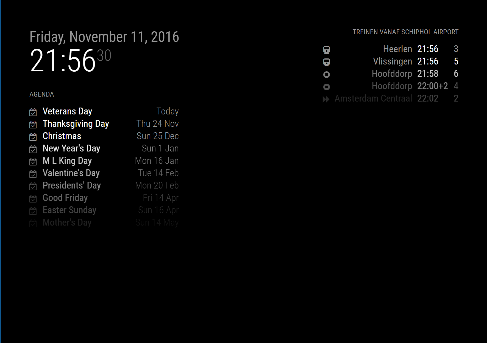
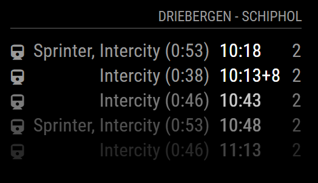

# NS Trains - MagicMirror² module

[](https://travis-ci.org/qistoph/MMM-nstreinen)

This is a module for [MagicMirror²](https://github.com/MichMich/MagicMirror).
Shows informantion on trains departuring a configurable Dutch trainstation.




## Installing the module

To install the module, just clone this repository to your __modules__ folder:
`git clone https://github.com/qistoph/MMM-nstreinen.git nstreinen`.
Then run `cd nstreinen` and `npm install` to install the dependencies.

## Using the module

You will need a username and password for the NS-API.
These can be requested at <http://www.ns.nl/reisinformatie/ns-api>.

To use this module, add it to the modules array in the `config/config.js` file:

```javascript
modules: [
  {
    module: 'nstreinen',
    position: 'top_right',
    header: 'Treinen vanaf Schiphol Airport',
    config: {
      user:'<NS-API-username>',
      pass: '<NS-API-password>',
      station: 'Schiphol Airport'
    }
  }
]
```

## Configuration options

The following properties can be configured:

Option | Description
------ | -----------
`user` | Your API username. Most likely in the form of an e-mailaddress.<br>Request your credentials at [NS API](http://www.ns.nl/reisinformatie/ns-api)<br>**Required**
`pass` | Your API password.<br>**Required**
`station` | The station to show trains for.<br>**Required**
`destination` | The destination to show trains for. If this is configured the trains and required transfers from `station` to this destination will be shown.<br>**Optional**
`maxEntries` | Maximum number of trains to show per station.<br>**Default value:** `5`
`reloadInterval` | Number of milliseconds between refresh.<br>Keep in mind there is a maximum of 50.000 requests per day for the API.<br>**Default value:** `5 * 60 * 1000` (5 minutes)
`departureOffset` | Trip planning only, requires destination: Number of seconds to 'delay' the trip plan with.<br>Especially usefull when you need time to travel to the train station.<br>**Default value:** `0` (0 seconds)
`displaySymbol` | Defines wether or not to show a symbol for each line.<br>**Possible values:** `true` or `false`.<br>**Default value:** `true`
`symbolMapping` | Maps the train types to the symbol to show.<br>If the train type is not found, the symbol for `default` is used.<br>**Possible symbols:** See [Font Awesome](http://fontawesome.io/icons/) website.<br>**Default value:** See [Default symbolMapping](#default-symbolmapping).
`fade` | Fade the trains listed to black. (Gradient)<br>**Possible values:** `true` or `false`<br>**Default value:** `true`
`fadePoint` | Where to start fade?<br>**Possible values:** `0` (top of the list) - `1` (bottom of list) <br>**Default value:** `0.25`

### Default symbolMapping

````javascript
symbolMapping: {
  'Intercity': 'train',
  'Intercity direct': 'forward',
  'Sprinter': 'stop-circle',
  'Stopbus i.p.v. trein': 'bus',
  'Snelbus i.p.v. trein': 'bus',
  'default': 'train'
}
````
